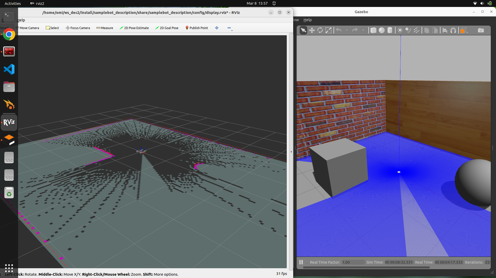
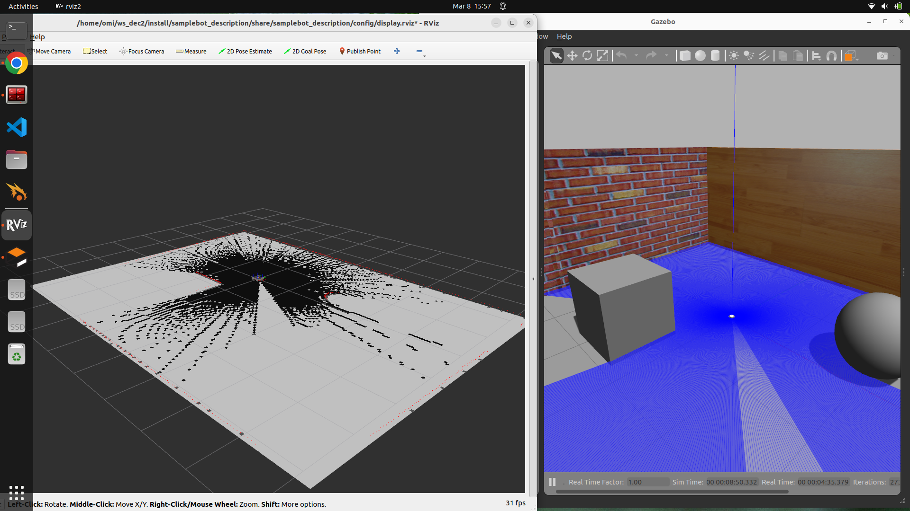

# 🤖 ROS2 SLAM & Navigation2 Autonomous Robot Simulation


🚀 **Autonomous Mobile Robot Simulation using ROS2, SLAM Toolbox, and Navigation2 in Gazebo with RViz2 visualization.**

This project demonstrates how a mobile robot can **build a map of an unknown environment (SLAM)** and then **autonomously navigate to a goal location (Navigation2)** inside a Gazebo simulation environment.

---

# 📌 Project Overview

This project implements **autonomous navigation for a mobile robot using ROS2**.

The robot explores an environment, generates a map using **SLAM Toolbox**, and then navigates autonomously using **Navigation2 path planning algorithms**.

The simulation is performed in **Gazebo**, while robot sensors, map data, and navigation paths are visualized using **RViz2**.

### 🔑 Key Concepts Demonstrated

* Simultaneous Localization and Mapping (SLAM)
* Autonomous Robot Navigation
* Path Planning and Obstacle Avoidance
* Robot Simulation using Gazebo
* Sensor Visualization using RViz2

---

# 🛠️ Technologies Used

| Technology                   | Description                        |
| ---------------------------- | ---------------------------------- |
| 🤖 **ROS2 Humble**           | Robotics middleware framework      |
| 🌍 **Gazebo**                | 3D robotics simulation environment |
| 🧭 **SLAM Toolbox**          | Real-time mapping and localization |
| 🚗 **Navigation2 (Nav2)**    | Autonomous navigation stack        |
| 📊 **RViz2**                 | Robot visualization and debugging  |
| ⌨️ **Teleop Twist Keyboard** | Manual robot control               |

---

# ⚙️ System Workflow

The project workflow follows these steps:

1️⃣ Launch the robot in the Gazebo simulation environment
2️⃣ Start SLAM to generate a map of the environment
3️⃣ Control the robot manually using the keyboard
4️⃣ Build a complete map of the environment
5️⃣ Use Navigation2 to navigate the robot autonomously

---

# 💻 System Requirements

Before running the project ensure the following software is installed:

* Ubuntu 22.04
* ROS2 Humble
* Gazebo Simulator
* SLAM Toolbox
* Navigation2
* RViz2

Install dependencies:

```
sudo apt update
sudo apt install ros-humble-navigation2
sudo apt install ros-humble-nav2-bringup
sudo apt install ros-humble-slam-toolbox
sudo apt install ros-humble-teleop-twist-keyboard
```

---

# 📂 Project Structure

```
ROS2-SLAM-Navigation2
│
├── README.md
├── 1st.png
├── 2nd.png
├── 3rd.png
├── 4th.png
```

---

# 🖥️ Simulation Steps

---

## 1️⃣ Robot Spawn in Gazebo

The robot model is launched in the Gazebo simulation environment.

### 🌍 Gazebo Simulation


### ▶️ Command

```
ros2 launch samplebot_description samplebot.launch.py use_sim_time:=True
```

This command loads the robot description and spawns the robot in the Gazebo world.

---

## 2️⃣ SLAM Mapping

The robot creates a real-time map using **SLAM Toolbox** while exploring the environment.


### ▶️ Command

```
ros2 launch bot_slam online_async_launch.py
```

The robot continuously updates the map as it moves through the environment.

---

## 3️⃣ Teleoperation Control

The robot is manually controlled using keyboard commands.



### ▶️ Command

```
ros2 run teleop_twist_keyboard teleop_twist_keyboard
```

Keyboard keys such as **W, A, S, D** are used to control the robot movement.

---

## 4️⃣ Autonomous Navigation

Once the map is generated, the robot can autonomously navigate to a target location.



### ▶️ Command

```
ros2 launch bot_nav navigation_launch.py
```

Using RViz2, the user can set a **2D Navigation Goal**, and the robot automatically plans and follows the optimal path.

---

# ✨ Features

✅ Real-time SLAM mapping
✅ Autonomous navigation using Navigation2
✅ Robot simulation in Gazebo
✅ Visualization using RViz2
✅ Manual control using keyboard teleoperation
✅ Path planning and obstacle avoidance

---

# 🚀 Applications

This project demonstrates technologies used in modern robotics systems such as:

* 📦 Warehouse automation robots
* 🤖 Service robots
* 🏭 Industrial mobile robots
* 🛰️ Autonomous inspection robots
* 🎓 Robotics education and research

---

# 🎥 Project Demonstration

A demo video of the project showing **SLAM mapping and autonomous navigation** is included in this repository.

---

# 📈 Future Improvements

Possible improvements for the project:

* Autonomous obstacle avoidance
* Multi-robot navigation
* Real robot implementation
* Integration with ROS2 perception packages
* Advanced path planning algorithms

---

# 👨‍💻 Author

omkar maroti honrao

B.tech Electrical engineering
Email-omkarhonrao108@gmail.com
---

