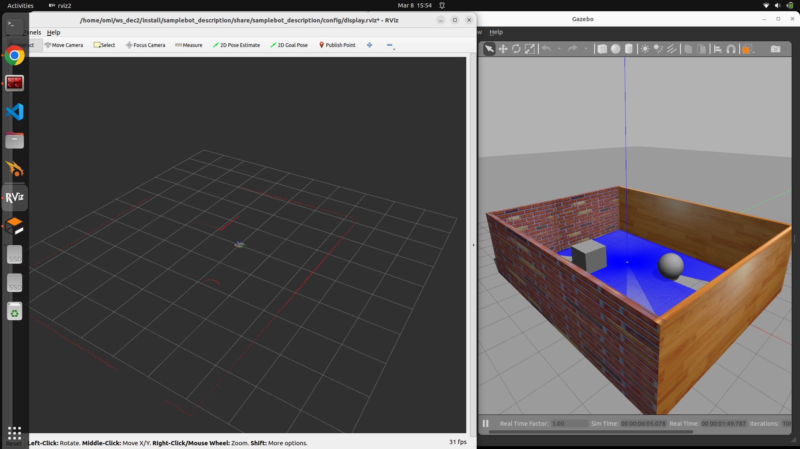
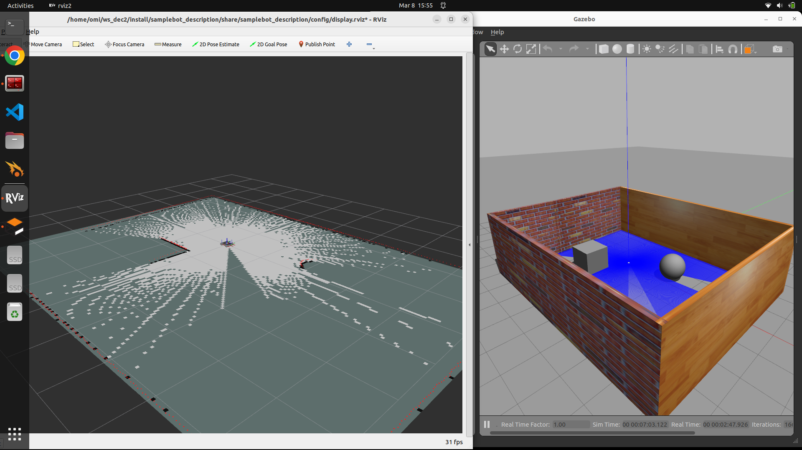

# ROS2-SLAM-and-Navigation2-simulation-using-Gazebo-and-RViz2-for-autonomous-mobile-robot-navigation.
ROS2-based autonomous mobile robot simulation using SLAM Toolbox and Navigation2 for mapping and path planning in Gazebo with RViz2 visualization.
# ROS2 SLAM and Navigation2 Autonomous Mobile Robot Simulation

## Overview

This project demonstrates **autonomous mobile robot mapping and navigation using ROS2**. The system uses **SLAM Toolbox for real-time mapping** and **Navigation2 for autonomous path planning and navigation** in a simulated environment using **Gazebo**. Visualization and monitoring of the robot, sensors, and navigation path are performed using **RViz2**.

The robot first performs **Simultaneous Localization and Mapping (SLAM)** to build a map of an unknown environment. After the map is generated, **Navigation2** is used to plan and execute an autonomous path to reach a user-defined goal.

This project demonstrates fundamental robotics concepts including **robot localization, mapping, path planning, and autonomous navigation**.

---

## Technologies and Tools Used

* **ROS2 Humble** – Robot Operating System framework for robotics development
* **Gazebo Simulator** – 3D robotics simulation environment
* **SLAM Toolbox** – Real-time mapping and localization
* **Navigation2 (Nav2)** – Autonomous navigation framework for ROS2
* **RViz2** – Visualization tool for robot state, sensors, and navigation
* **Teleop Twist Keyboard** – Manual control of robot movement

---

## System Workflow

The project follows the following workflow:

1. Launch the robot model in the Gazebo simulation environment.
2. Start SLAM to build a map of the environment using sensor data.
3. Manually control the robot using the keyboard to explore the environment.
4. Save the generated map.
5. Launch Navigation2 and set a target goal for autonomous navigation.

---

## Simulation

### 1. Robot Spawn in Gazebo

The robot model is launched inside the Gazebo simulation environment.

### 🔹 Gazebo Simulation


---
🔹 SLAM Mapping


---

### 🔹 Autonomous Navigation in RViz

---

**Command**

```
ros2 launch samplebot_description samplebot.launch.py use_sim_time:=True
```

This command loads the robot description and spawns the robot in the Gazebo simulation world.

---

### 2. SLAM Mapping

SLAM Toolbox is used to generate a real-time map of the environment using sensor data such as LiDAR.



**Command**

```
ros2 launch bot_slam online_async_launch.py
```

During this process, the robot continuously updates the map as it explores the environment.

---

### 3. Teleoperation Control

The robot is manually controlled using keyboard commands to explore the environment and build a complete map.


**Command**

```
ros2 run teleop_twist_keyboard teleop_twist_keyboard
```

This allows the user to move the robot using keyboard inputs such as **W, A, S, D keys**.

---

### 4. Autonomous Navigation

After the map is generated, Navigation2 is used to allow the robot to autonomously navigate to a goal location.


**Command**

```
ros2 launch bot_nav navigation_launch.py
```

Using RViz2, the user can set a **2D Navigation Goal**, and the robot will automatically plan and follow the optimal path to reach the target.

---

## Features

* Real-time **SLAM mapping**
* **Autonomous navigation using Navigation2**
* **Gazebo simulation environment**
* **Robot visualization using RViz2**
* **Manual robot control using keyboard**
* **Path planning and obstacle avoidance**

---

## Applications

This project demonstrates core concepts used in real-world robotics applications such as:

* Autonomous warehouse robots
* Service robots
* Indoor navigation systems
* Autonomous inspection robots
* Robotics research and education

---

## Project Demonstration

A demonstration video of the project showing **SLAM mapping and autonomous navigation** is included in the repository.

---

## Author

Developed as part of a robotics learning project focusing on **ROS2-based autonomous mobile robot navigation**.
